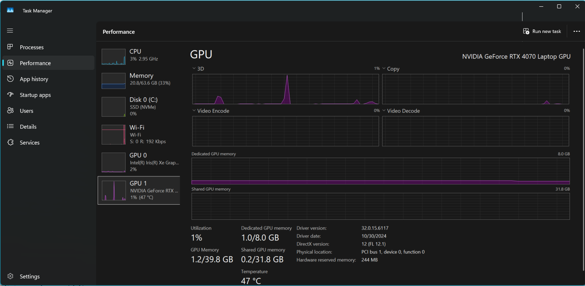

# AI Experiments

### Docker with AI models

``` cmd
docker model pull ai/smollm2
docker model list
# interactive mode
docker model run ai/smollm2
# confirm model runner is active on localhost
curl http://localhost:12434
```

#### GPU Usage



### Simple C# AI Client talking to Docker AI Model

See the code in [SimpleAIClient](SimpleAIClient)

### What is Quantization

[Quantization](Quantization.md)

### Connecting up an AI to an Angular Application w/a C# app api
Coming soon

### Postgres with pgvector
Coming soon

### RAG Example
Coming soon

### Integration with TAM - an example
Coming soon

### References
https://dzone.com/articles/docker-model-runner-dotnet-guide
